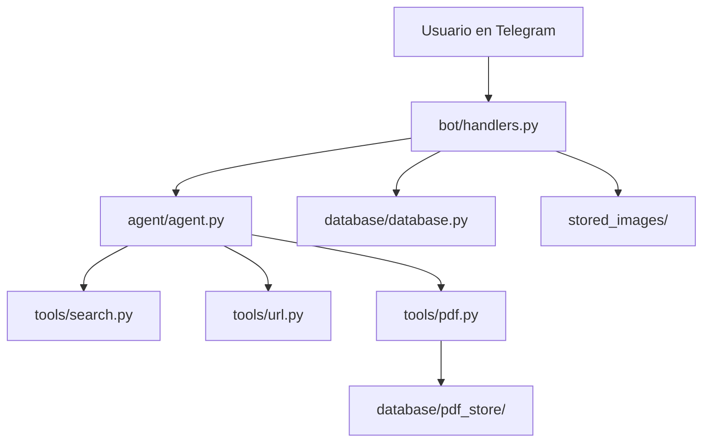

# Telegram Bot IA

Bot de Telegram con IA para conversar, buscar en la web, leer URLs, analizar imágenes y consultar PDFs cargados por el usuario.

## Funcionalidades

- Chat general con Gemini 2.5 Flash.
- Búsqueda web con DuckDuckGo.
- Lectura y resumen de URLs.
- Carga de PDFs y búsqueda semántica dentro de cada documento.
- Análisis de imágenes enviadas por Telegram.
- Memoria separada por usuario.
- Guardado de imágenes en disco.
- Persistencia local del índice de PDFs.

## Stack

- Python 3.11+
- `python-telegram-bot`
- `langchain`
- `langchain-google-genai`
- `langchain-community`
- `langchain-chroma`
- `langchain-huggingface`
- `ddgs`
- `httpx`
- `beautifulsoup4`

## Uso

1. Iniciá el bot con `/start`.
2. Elegí Gemini.
3. Escribí una consulta normal o mandá:
   - una URL para resumirla,
   - un PDF para indexarlo,
   - una imagen para analizarla.
4. Luego preguntale al bot sobre el contenido del PDF cargado.

## Flujo interno



## Estructura

```text
telegram-bot/
├── main.py
├── bot/
│   ├── handlers.py
│   └── keyboards.py
├── agent/
│   ├── agent.py
│   └── memory.py
├── database/
│   └── database.py
├── tools/
│   ├── search.py
│   ├── url.py
│   ├── pdf.py
│   └── image.py
├── stored_images/
├── requirements.txt
└── README.md
```

## Persistencia

- Las imágenes se guardan en `stored_images/`.
- La base SQLite queda en `database/bot_images.db`.
- Los índices de PDF se guardan en `database/pdf_store/`.

## Notas técnicas

- El bot usa memoria por usuario para no mezclar conversaciones.
- El procesamiento pesado de PDFs, imágenes y llamadas al agente se ejecuta fuera del event loop principal.
- El bot actualmente está configurado para usar solo Gemini.

## Archivos clave

- `main.py`: arranque del bot.
- `bot/handlers.py`: handlers de Telegram.
- `agent/agent.py`: configuración del agente y herramientas.
- `tools/pdf.py`: carga, persistencia y búsqueda en PDFs.
- `tools/search.py`: búsqueda web.
- `tools/url.py`: extracción de contenido desde URLs.
- `database/database.py`: guardado local de imágenes.

## Mejoras futuras

- Persistir también la memoria conversacional.
- Añadir comandos explícitos para listar PDFs cargados.
- Mejorar el manejo de errores por tipo de entrada.
- Separar el análisis de imágenes en un flujo más configurable.